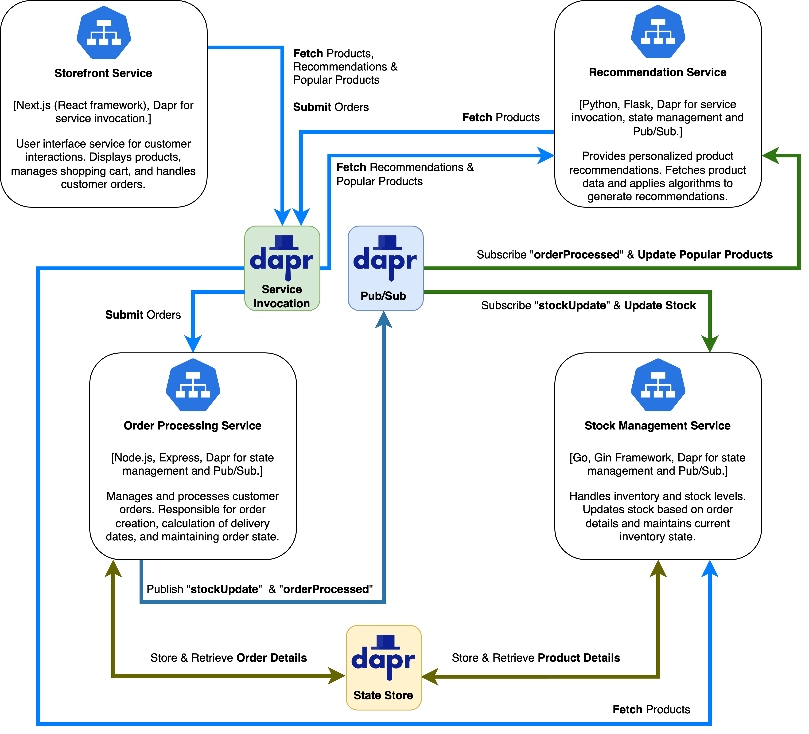

# Microservices Application for E-Commerce

## Overview
This repository contains the microservices architecture for a simulated e-commerce application. It's designed to demonstrate a cloud-native approach using Kubernetes and Dapr. The application is divided into four main components, each residing in its own directory:

1. **order-processing-app**: Manages the processing of orders.
2. **recommendation-app**: Handles product recommendations.
3. **stock-management-app**: Responsible for stock level management.
4. **storefront-app**: Represents the user-facing application for the storefront.

## Solution Architecture Diagram
Below is the solution architecture diagram for the e-commerce application:



## Pre-requisites
- A Kubernetes cluster.
- Dapr configured on the Kubernetes cluster.
- Redis installed on the Kubernetes cluster.
- Zipkin installed for tracing.
- Basic understanding of Kubernetes resource definitions.

### Installing Dapr using Helm
To install Dapr on your Kubernetes cluster using Helm, follow these steps:
```bash
helm repo add dapr https://dapr.github.io/helm-charts/
helm repo update
kubectl create namespace dapr-system
helm install dapr dapr/dapr --namespace dapr-system
```

### Installing Redis using Helm
Redis is used for state management and caching. To install Redis on your Kubernetes cluster, use the following Helm commands:
```bash
helm repo add bitnami https://charts.bitnami.com/bitnami
helm repo update
helm install redis bitnami/redis --namespace <your-namespace>
```
**Note**: Replace `<your-namespace>` with the namespace where you want to deploy Redis. This namespace should be the same as where your microservices will be deployed.

### Installing Zipkin for Tracing
Zipkin provides distributed tracing functionality. To install Zipkin, use the following Helm commands:
```bash
helm repo add openzipkin https://openzipkin.github.io/zipkin/
helm repo update
helm install zipkin openzipkin/zipkin
```
**Note**: To configure Dapr to send traces to Zipkin, update the Zipkin `endpointAddress` in `./order-processing-app/k8s/base/dapr-tracing-config.yaml` to include Zipkin as a tracing backend.

## Deployment Instructions

### Common Setup
Before deploying the services, complete the following setup:

1. Create the `e-commerce-app` namespace where all the microservices will be deployed:
   ```bash
   kubectl create namespace e-commerce-app
   ```
2. Update your Redis host and Redis password in `./order-processing-app/k8s/common/redis-secret.yaml`.
3. Apply the Redis secret:
   ```bash
   kubectl apply -f ./order-processing-app/k8s/common/redis-secret.yaml -n e-commerce-app
   ```
4. Build and push Docker images for each microservice. Ensure each folder has a Dockerfile. Run the following commands:

   First, log in to Docker Hub:
   ```bash
   docker login
   ```

   In the `order-processing-app` folder:
   ```bash
   docker build -t <your-docker-hub-username>/order-processing-app:latest .
   docker push <your-docker-hub-username>/order-processing-app:latest
   ```

   In the `stock-management-app` folder:
   ```bash
   docker build -t <your-docker-hub-username>/stock-management-app:latest .
   docker push <your-docker-hub-username>/stock-management-app:latest
   ```

   In the `recommendation-app` folder:
   ```bash
   docker build -t <your-docker-hub-username>/recommendation-app:latest .
   docker push <your-docker-hub-username>/recommendation-app:latest
   ```

   In the `storefront-app` folder:
   ```bash
   docker build -t <your-docker-hub-username>/storefront-app:latest .
   docker push <your-docker-hub-username>/storefront-app:latest
   ```

   **Note**: Replace `<your-docker-hub-username>` with your actual Docker Hub username. The `latest` tag indicates the most recent version, but consider using specific version tags for better version control.

5. Update the image names in the Kubernetes configuration in `./k8s/overlays/development/kustomization.yaml` for each service.

**Note on Building Docker Images in Kubernetes**:
There are various methods for building Docker images in Kubernetes environments, each suited to different requirements. You could choose the one that best suits your project:

- **Current Approach (Using Docker Hub)**: As shown earlier, build and push images to Docker Hub using the `docker build` and `docker push` commands.
- **Buildpacks**: Streamlines image creation from code. [Discover Buildpacks](https://buildpacks.io/).
- **Buildah**: A great choice for OCI images. [Learn more about Buildah](https://buildah.io/).
- **kaniko**: Builds images securely within Kubernetes clusters. [More on kaniko](https://github.com/GoogleContainerTools/kaniko).
- **Jib**: Optimized for Java applications, builds images without needing Dockerfiles. [Explore Jib](https://github.com/GoogleContainerTools/jib).
- **KO**: Designed specifically for Go applications. [Read about KO](https://github.com/google/ko).

Each option provides distinct benefits, making them suitable for various scenarios and requirements.

### Deploying the Microservices
Deploy the microservices with the following commands:
```bash
kubectl apply -k ./order-processing-app/k8s/overlays/development/ -n e-commerce-app
kubectl apply -k ./recommendation-app/k8s/overlays/development/ -n e-commerce-app
kubectl apply -k ./stock-management-app/k8s/overlays/development/ -n e-commerce-app
kubectl apply -k ./storefront-app/k8s/overlays/development/ -n e-commerce-app
```

### Deleting the Microservices
To remove the services, use:
```bash
kubectl delete -k ./order-processing-app/k8s/overlays/development/ -n e-commerce-app
kubectl delete -k ./recommendation-app/k8s/overlays/development/ -n e-commerce-app
kubectl delete -k ./stock-management-app/k8s/overlays/development/ -n e-commerce-app
kubectl delete -k ./storefront-app/k8s/overlays/development/ -n e-commerce-app
```

## Validation Steps
After deployment, verify that the microservices are running correctly with:
```bash
kubectl get pods -n e-commerce-app
```

## Troubleshooting Tips
If you encounter issues during deployment or runtime, use these steps to identify and resolve common problems:

1. **Checking Pod Logs**:
   - For a specific microservice's pod:
     ```bash
     kubectl logs <pod-name> -n e-commerce-app
     ```
   - For the Dapr sidecar in a pod:
     ```bash
     kubectl logs <pod-name> -c daprd -n e-commerce-app
     ```

2. **Checking Dapr Sidecar Injector Logs and Restarting if Necessary**:
   - If experiencing certificate issues or problems with sidecar injection, first check the logs:
     ```bash
     kubectl logs -l app=dapr-sidecar-injector -n dapr-system
     ```
   - Restarting the `dapr-sidecar-injector` can sometimes resolve these issues:
     ```bash
     kubectl rollout restart deployment/dapr-sidecar-injector -n dapr-system
     ```

3. **Describing Pods**:
   - If a pod is failing to start, use `describe` to get more details:
     ```bash
     kubectl describe pod <pod-name> -n e-commerce-app
     ```

4. **SSH into Pods**:
   - To access a shell within a pod:
     ```bash
     kubectl exec -it <pod-name> -n e-commerce-app -- /bin/bash
     ```
   - Specify the container name if the pod contains multiple containers:
     ```bash
     kubectl exec -it <pod-name> -c <container-name> -n e-commerce-app -- /bin/bash
     ```

5. **General Steps**:
   - Verify correct installation and configuration of all pre-requisites.
   - Inspect Kubernetes resources (namespaces, services, deployments, pods) using `kubectl get` commands.

6. **Refer to Documentation**:
   For additional information on the technologies used in this project, the following official documentation is recommended:

   - **Kubernetes**: The [Kubernetes Documentation](https://kubernetes.io/docs/home/) provides essential guides and resources for managing Kubernetes environments.
   - **Dapr**: Explore the [Dapr Documentation](https://docs.dapr.io/) to understand Dapr's capabilities, particularly the [Building Blocks](https://docs.dapr.io/concepts/building-blocks-concept/) section for core concepts.
   - **Redis**: Detailed information on Redis setup and usage can be found in the [Redis Documentation](https://redis.io/documentation).
   - **Zipkin**: For implementing distributed tracing, refer to the [Zipkin Documentation](https://zipkin.io/pages/quickstart.html).

   These resources are valuable for gaining insights into each technology and effective problem-solving.

## Note
- Please ensure that all pre-requisites are met before deployment.

## Copyright and License

**Copyright Notice**  
© 2024 [Kunigitaj](http://www.kunigitaj.com/). All rights reserved.

The content and source code in this repository are the intellectual property of Kunigitaj. Unauthorized replication, modification, or distribution of the materials in this repository without express permission is strictly prohibited. For permissions beyond the scope of this license, please contact [info@kunigitaj.com](mailto:info@kunigitaj.com).

**License Agreement**  
This project is licensed under the Creative Commons Attribution-NonCommercial 4.0 International License (CC BY-NC 4.0), allowing non-commercial use with attribution. Users are free to remix, adapt, and build upon this work non-commercially, as long as they credit Kunigitaj and license their new creations under identical terms.

Full license terms are available at the [Creative Commons Attribution-NonCommercial 4.0 International License](http://creativecommons.org/licenses/by-nc/4.0/) page.
